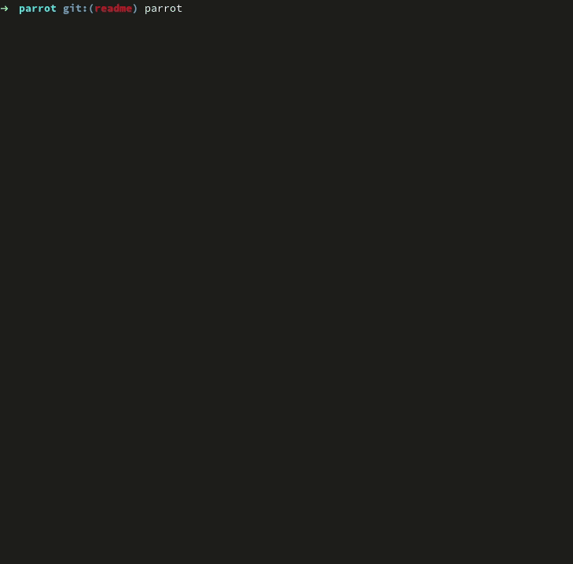

# Parrot 🦜

A command-line snapshot testing tool for your scripts and CLI programs.

<div align="center">
  
</div>

**parrot** allows you to take and organize snapshots of your program outputs (status code, stdout and stderr) and later check that those ouputs are still the same.

#### Features
- Effortless end-to-end testing of scripts and CLI programs.
- Organize snapshots with tags.
- Interactive REPL to navigate and interact with your snapshots.

## Disclaimer

This project is still under development, it may have rough corners and the interface may change overtime. Don't hesitate to try it for small projects, but don't rely solely on **parrot** for your production grade software test suite.

## Table of contents

- [Installation](#installation)
- [Principle](#principle)
- [Usage](#usage)
  - [Quit](#quit-q)
  - [Help](#help-h)
  - [Filter](#filter-f)
  - [Clear](#clear-c)
  - [Run](#run-r)
  - [Show](#show-s)
  - [Edit](#edit-e)
  - [Update](#update-u)
  - [Delete](#delete-d)
- [Customization](#customization)
- [Current limitations](#current-limitations)

## Installation

You first need to [install Rust](https://www.rust-lang.org/tools/install), then you can install **parrot** with 

```sh
cargo install parrot-snap
```

## Usage

To use **parrot** with your project, you first have to initialize it:

```sh
parrot init
```

This will create a `.parrot` folder that will hold all your snapshots. You can then add your first snapshot:

```sh
parrot add 'echo "Hello, world!"'
```

**parrot** will show you a preview of the snapshot and ask for confirmation. If you decide to save the snapshot **parrot** will open your favorite editor, there you can edit the description file: the first line will be used as the snapshot name, the rest as description. Exit your editor and you're good, you've created your first snapshot.

You can now check that your program's outputs didn't change with:

```sh
parrot run
```

For a more interactive experience, for instance while developing, you can open **parrot**'s REPL with:

```sh
parrot
```

From there you can navigate snapshots and execute commands.

### Principle

A central feature of **parrot** is the ability to add tags to snapshots: each time you add snapshot you are asked for a name and a description, if you put hashtags in the descriptions (like `#this`) those can be use later to browse and run your snapshots.
When working in the REPL, **parrot** maintains a **view** of your snapshots, you can modify that view with the `filter` and `clear` commands (see next section) to search by names, tags or even failing snapshots. By using tag wisely you can easily run only the part of your test set that correspond to what you are working on, or infer the issue by browsing tags of failing tests.

### Parrot commands

In REPL mode you have access to a few commands to interact with your snapshots, most commands have a 1 letter shorthand version to help you get things done faster.

Here is the list of available commands and their descriptions:

#### Quit (q)

```
quit
q
```

Quit parrot.

#### Help (h)

```
help
h
```

Display the commands cheat-sheet.

#### Filter (f)

```
filter <name>
f <name>
f #<tag>
f ~
f +
f -
```

Apply a filter to the current view:
- `<name>`: Select all snapshots with a name containing `<name>`.
- `#<tag>`: Select all snapshots with the tag `<tag>`.
- `~`: Select all snapshots with 'waiting to be run' status.
- `+`: Select all snapshots with 'passed' status.
- `-`: Select all snapshots withh 'failed' status.

#### Clear (c)

```
clear
c
```

Remove all filters from the current view.

#### Run (r)

```
run
r
r *
```

Run the selected snapshot, or all snapshots in the current view if `*` is passed as argument.

#### Show (s)

```
show
s
s *
```

Show the selected snapshot, or all snapshots in the current view if `*` is passed as argument.

#### Edit (e)

```
edit
e
```

Edit the selected snapshot name or description.

#### Update (u)

```
update
u
u *
```

Update the selected snapshot by running the command and saving the new outputs. Update all the snapshots in the current view if `*` is passed as argument.

#### Delete (d)

```
delete
d
d *
```

Delete the selected snapshot, or all snapshots in the current view if `*` is passed as argument.

## Customization

To decide which editor to use, **parrot** looks at the `EDITOR` environment variable, you can change your default editor by setting this variable:

```sh
export EDITOR=nvim
```

## Current limitations

**parrot** is developed and tested on Linux, it should work on MacOS too (can someone confirm that?).

